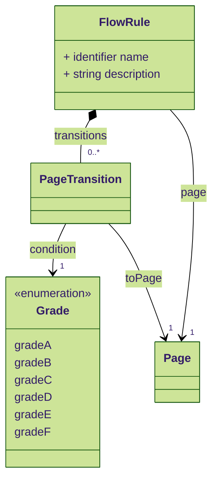

# Class diagram for file edu-flow

```mermaid
    %%{init: {'theme': 'forest'} }%%
    classDiagram
    direction TD
    %% other possibilites: LR RL DT TB (same as TD)
    class FlowRule {
        
        + identifier name
		+ string description
    }
    class PageTransition {
        
        
    }
    class Grade {
        <<enumeration>>
        gradeA
		gradeB
		gradeC
		gradeD
		gradeE
		gradeF
    }

    
        FlowRule *-- "0..*" PageTransition : transitions

        FlowRule --> "1" Page : page
PageTransition --> "1" Grade : condition

		PageTransition --> "1" Page : toPage

        
```
