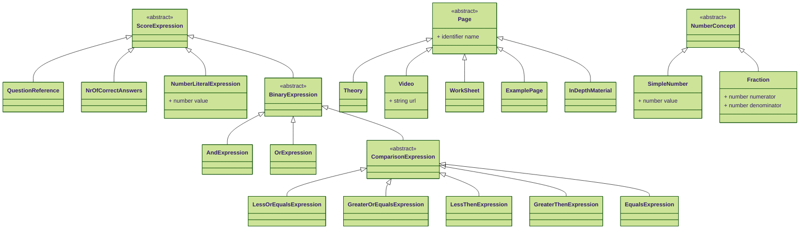

# Inheritance diagram for language Education

```mermaid
    %%{init: {'theme': 'forest'} }%%
    classDiagram
    direction TD
    %% other possibilites: LR RL DT TB (same as TD)
    class QuestionReference {
        
        
    }
    class ScoreExpression {
        <<abstract>>
        
    }
    class NrOfCorrectAnswers {
        
        
    }
    class NumberLiteralExpression {
        
        + number value
    }
    class BinaryExpression {
        <<abstract>>
        
    }
    class AndExpression {
        
        
    }
    class OrExpression {
        
        
    }
    class ComparisonExpression {
        <<abstract>>
        
    }
    class LessOrEqualsExpression {
        
        
    }
    class GreaterOrEqualsExpression {
        
        
    }
    class LessThenExpression {
        
        
    }
    class GreaterThenExpression {
        
        
    }
    class EqualsExpression {
        
        
    }
    class Theory {
        
        
    }
    class Page {
        <<abstract>>
        + identifier name
    }
    class Video {
        
        + string url
    }
    class WorkSheet {
        
        
    }
    class ExamplePage {
        
        
    }
    class InDepthMaterial {
        
        
    }
    class SimpleNumber {
        
        + number value
    }
    class NumberConcept {
        <<abstract>>
        
    }
    class Fraction {
        
        + number numerator
		+ number denominator
    }
    ScoreExpression <|-- QuestionReference
ScoreExpression <|-- NrOfCorrectAnswers
ScoreExpression <|-- NumberLiteralExpression
ScoreExpression <|-- BinaryExpression
BinaryExpression <|-- AndExpression
BinaryExpression <|-- OrExpression
BinaryExpression <|-- ComparisonExpression
ComparisonExpression <|-- LessOrEqualsExpression
ComparisonExpression <|-- GreaterOrEqualsExpression
ComparisonExpression <|-- LessThenExpression
ComparisonExpression <|-- GreaterThenExpression
ComparisonExpression <|-- EqualsExpression
Page <|-- Theory
Page <|-- Video
Page <|-- WorkSheet
Page <|-- ExamplePage
Page <|-- InDepthMaterial
NumberConcept <|-- SimpleNumber
NumberConcept <|-- Fraction

```
