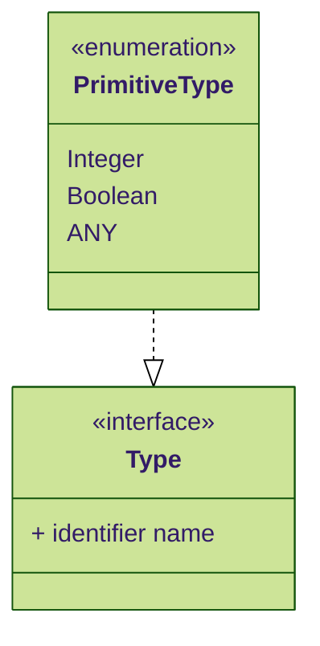

# Class diagram for file edu-main

```mermaid
    %%{init: {'theme': 'forest'} }%%
    classDiagram
    direction TD
    %% other possibilites: LR RL DT TB (same as TD)
    class PrimitiveType {
        <<enumeration>>
        Integer
		Boolean
		ANY
    }
    class Type {
        <<interface>>
        + identifier name
    }
    
        
        
        PrimitiveType ..|> Type

```
