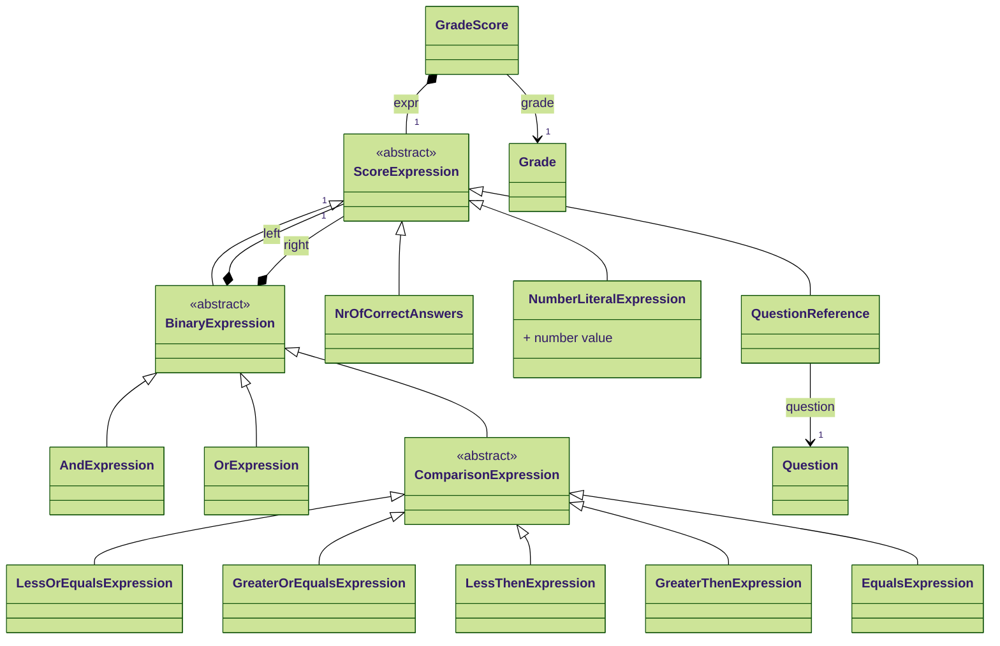

# Class diagram for file edu-scoring

```mermaid
    %%{init: {'theme': 'forest'} }%%
    classDiagram
    direction TD
    %% other possibilites: LR RL DT TB (same as TD)
    class GradeScore {
        
        
    }
    class ScoreExpression {
        <<abstract>>
        
    }
    class QuestionReference {
        
        
    }
    class NrOfCorrectAnswers {
        
        
    }
    class NumberLiteralExpression {
        
        + number value
    }
    class BinaryExpression {
        <<abstract>>
        
    }
    class AndExpression {
        
        
    }
    class OrExpression {
        
        
    }
    class ComparisonExpression {
        <<abstract>>
        
    }
    class LessOrEqualsExpression {
        
        
    }
    class GreaterOrEqualsExpression {
        
        
    }
    class LessThenExpression {
        
        
    }
    class GreaterThenExpression {
        
        
    }
    class EqualsExpression {
        
        
    }

    ScoreExpression <|-- QuestionReference
ScoreExpression <|-- NrOfCorrectAnswers
ScoreExpression <|-- NumberLiteralExpression
ScoreExpression <|-- BinaryExpression
BinaryExpression <|-- AndExpression
BinaryExpression <|-- OrExpression
BinaryExpression <|-- ComparisonExpression
ComparisonExpression <|-- LessOrEqualsExpression
ComparisonExpression <|-- GreaterOrEqualsExpression
ComparisonExpression <|-- LessThenExpression
ComparisonExpression <|-- GreaterThenExpression
ComparisonExpression <|-- EqualsExpression

        GradeScore *-- "1" ScoreExpression : expr
BinaryExpression *-- "1" ScoreExpression : left

		BinaryExpression *-- "1" ScoreExpression : right

        GradeScore --> "1" Grade : grade
QuestionReference --> "1" Question : question

        
```
