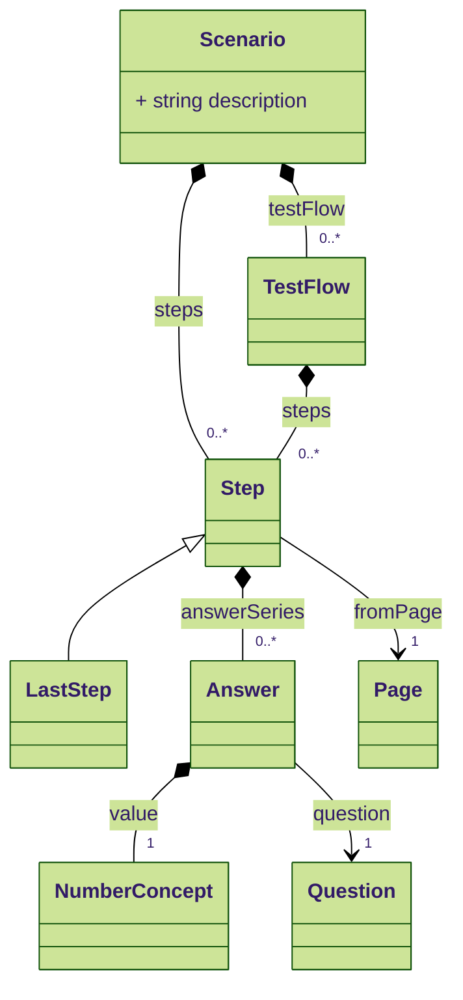

# Class diagram for file edu-tests

```mermaid
    %%{init: {'theme': 'forest'} }%%
    classDiagram
    direction TD
    %% other possibilites: LR RL DT TB (same as TD)
    class Scenario {
        
        + string description
    }
    class TestFlow {
        
        
    }
    class Step {
        
        
    }
    class LastStep {
        
        
    }
    class Answer {
        
        
    }

    Step <|-- LastStep

        Scenario *-- "0..*" TestFlow : testFlow

		Scenario *-- "0..*" Step : steps
TestFlow *-- "0..*" Step : steps
Step *-- "0..*" Answer : answerSeries
Answer *-- "1" NumberConcept : value

        Step --> "1" Page : fromPage
Answer --> "1" Question : question

        
```
