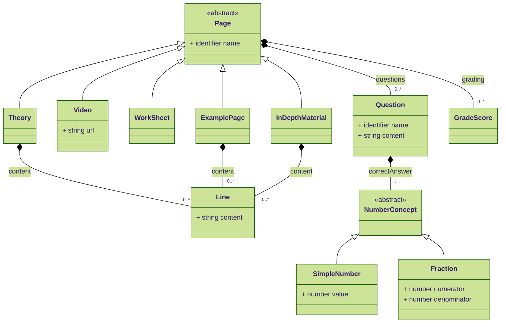

# Class diagram for file edu-topics

```mermaid
    %%{init: {'theme': 'forest'} }%%
    classDiagram
    direction TD
    %% other possibilites: LR RL DT TB (same as TD)
    class Page {
        <<abstract>>
        + identifier name
    }
    class Theory {
        
        
    }
    class Line {
        
        + string content
    }
    class Video {
        
        + string url
    }
    class WorkSheet {
        
        
    }
    class ExamplePage {
        
        
    }
    class InDepthMaterial {
        
        
    }
    class Question {
        
        + identifier name
		+ string content
    }
    class NumberConcept {
        <<abstract>>
        
    }
    class SimpleNumber {
        
        + number value
    }
    class Fraction {
        
        + number numerator
		+ number denominator
    }

    Page <|-- Theory
Page <|-- Video
Page <|-- WorkSheet
Page <|-- ExamplePage
Page <|-- InDepthMaterial
NumberConcept <|-- SimpleNumber
NumberConcept <|-- Fraction

        Page *-- "0..*" Question : questions

		Page *-- "0..*" GradeScore : grading
Theory *-- "0..*" Line : content
ExamplePage *-- "0..*" Line : content
InDepthMaterial *-- "0..*" Line : content
Question *-- "1" NumberConcept : correctAnswer

        
        
```
