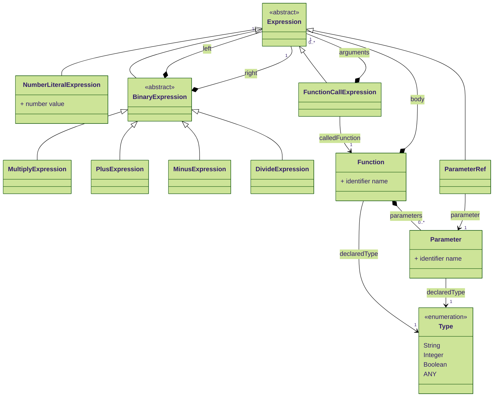

# Class diagram for language Expressions

```mermaid
    %%{init: {'theme': 'forest'} }%%
    classDiagram
    direction TD
    %% other possibilites: LR RL DT TB (same as TD)
    class Type {
        <<enumeration>>
        String
		Integer
		Boolean
		ANY
    }
    class Expression {
        <<abstract>>
        
    }
    class NumberLiteralExpression {
        
        + number value
    }
    class BinaryExpression {
        <<abstract>>
        
    }
    class MultiplyExpression {
        
        
    }
    class PlusExpression {
        
        
    }
    class MinusExpression {
        
        
    }
    class DivideExpression {
        
        
    }
    class Function {
        
        + identifier name
    }
    class Parameter {
        
        + identifier name
    }
    class ParameterRef {
        
        
    }
    class FunctionCallExpression {
        
        
    }

    Expression <|-- NumberLiteralExpression
Expression <|-- BinaryExpression
BinaryExpression <|-- MultiplyExpression
BinaryExpression <|-- PlusExpression
BinaryExpression <|-- MinusExpression
BinaryExpression <|-- DivideExpression
Expression <|-- ParameterRef
Expression <|-- FunctionCallExpression

        BinaryExpression *-- "1" Expression : left

		BinaryExpression *-- "1" Expression : right
Function *-- "1" Expression : body

		Function *-- "0..*" Parameter : parameters
FunctionCallExpression *-- "0..*" Expression : arguments

        Function --> "1" Type : declaredType
Parameter --> "1" Type : declaredType
ParameterRef --> "1" Parameter : parameter
FunctionCallExpression --> "1" Function : calledFunction

        
```
