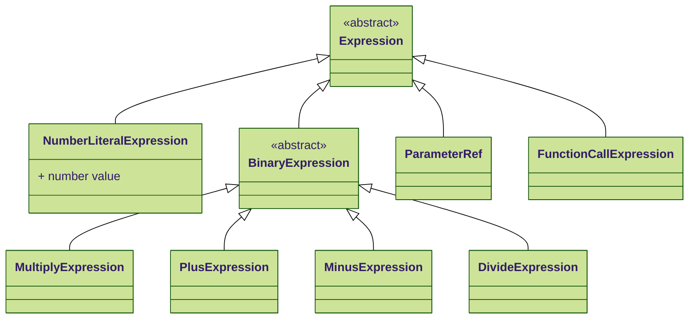

# Inheritance diagram for language Expressions

```mermaid
    %%{init: {'theme': 'forest'} }%%
    classDiagram
    direction TD
    %% other possibilites: LR RL DT TB (same as TD)
    class NumberLiteralExpression {
        
        + number value
    }
    class Expression {
        <<abstract>>
        
    }
    class BinaryExpression {
        <<abstract>>
        
    }
    class MultiplyExpression {
        
        
    }
    class PlusExpression {
        
        
    }
    class MinusExpression {
        
        
    }
    class DivideExpression {
        
        
    }
    class ParameterRef {
        
        
    }
    class FunctionCallExpression {
        
        
    }
    Expression <|-- NumberLiteralExpression
Expression <|-- BinaryExpression
BinaryExpression <|-- MultiplyExpression
BinaryExpression <|-- PlusExpression
BinaryExpression <|-- MinusExpression
BinaryExpression <|-- DivideExpression
Expression <|-- ParameterRef
Expression <|-- FunctionCallExpression

```
