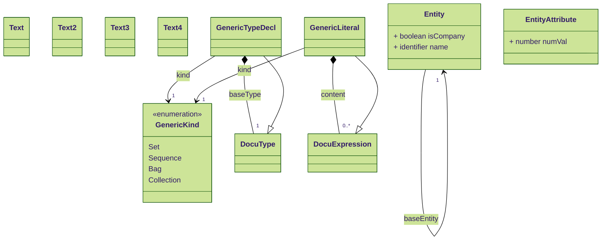

# Class diagram for file language-extras

```mermaid
    %%{init: {'theme': 'forest'} }%%
    classDiagram
    direction TD
    %% other possibilites: LR RL DT TB (same as TD)
    class Text {
        
        
    }
    class Text2 {
        
        
    }
    class Text3 {
        
        
    }
    class Text4 {
        
        
    }
    class GenericKind {
        <<enumeration>>
        Set
		Sequence
		Bag
		Collection
    }
    class GenericTypeDecl {
        
        
    }
    class GenericLiteral {
        
        
    }
    class Entity {
        
        + boolean isCompany
		+ identifier name
    }
    class EntityAttribute {
        
        + number numVal
    }

    DocuType <|-- GenericTypeDecl
DocuExpression <|-- GenericLiteral

        GenericTypeDecl *-- "1" DocuType : baseType
GenericLiteral *-- "0..*" DocuExpression : content

        GenericTypeDecl --> "1" GenericKind : kind
GenericLiteral --> "1" GenericKind : kind
Entity --> "1" Entity : baseEntity

        
```
