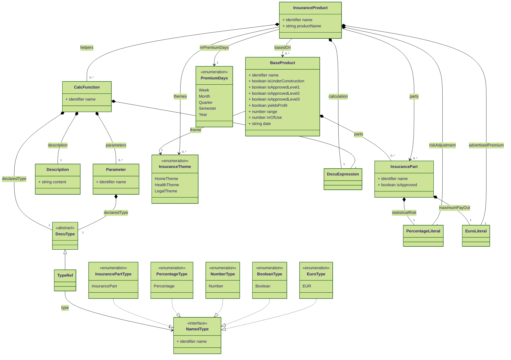

# Class diagram for file language-main

```mermaid
    %%{init: {'theme': 'forest'} }%%
    classDiagram
    direction TD
    %% other possibilites: LR RL DT TB (same as TD)
    class BaseProduct {
        
        + identifier name
		+ boolean isUnderConstruction
		+ boolean isApprovedLevel1
		+ boolean isApprovedLevel2
		+ boolean isApprovedLevel3
		+ boolean yieldsProfit
		+ number range
		+ number nrOfUse
		+ string date
    }
    class InsurancePart {
        
        + identifier name
		+ boolean isApproved
    }
    class InsuranceProduct {
        
        + identifier name
		+ string productName
    }
    class CalcFunction {
        
        + identifier name
    }
    class Description {
        
        + string content
    }
    class Parameter {
        
        + identifier name
    }
    class DocuType {
        <<abstract>>
        
    }
    class InsurancePartType {
        <<enumeration>>
        InsurancePart
    }
    class PercentageType {
        <<enumeration>>
        Percentage
    }
    class NumberType {
        <<enumeration>>
        Number
    }
    class BooleanType {
        <<enumeration>>
        Boolean
    }
    class EuroType {
        <<enumeration>>
        EUR
    }
    class TypeRef {
        
        
    }
    class InsuranceTheme {
        <<enumeration>>
        HomeTheme
		HealthTheme
		LegalTheme
    }
    class PremiumDays {
        <<enumeration>>
        Week
		Month
		Quarter
		Semester
		Year
    }
    class NamedType {
        <<interface>>
        + identifier name
    }
    DocuType <|-- TypeRef

        BaseProduct *-- "0..*" InsurancePart : parts
InsurancePart *-- "1" PercentageLiteral : statisticalRisk

		InsurancePart *-- "1" EuroLiteral : maximumPayOut
InsuranceProduct *-- "1" EuroLiteral : advertisedPremium

		InsuranceProduct *-- "1" PercentageLiteral : riskAdjustment

		InsuranceProduct *-- "1" DocuExpression : calculation

		InsuranceProduct *-- "0..*" CalcFunction : helpers
CalcFunction *-- "1" Description : description

		CalcFunction *-- "1" DocuType : declaredType

		CalcFunction *-- "1" DocuExpression : body

		CalcFunction *-- "0..*" Parameter : parameters
Parameter *-- "1" DocuType : declaredType

        BaseProduct --> "1" InsuranceTheme : theme
InsuranceProduct --> "0..*" InsuranceTheme : themes

		InsuranceProduct --> "1" PremiumDays : nrPremiumDays

		InsuranceProduct --> "0..*" InsurancePart : parts

		InsuranceProduct --> "0..*" BaseProduct : basedOn
TypeRef --> "1" NamedType : type

        InsurancePartType ..|> NamedType
PercentageType ..|> NamedType
NumberType ..|> NamedType
BooleanType ..|> NamedType
EuroType ..|> NamedType

```
