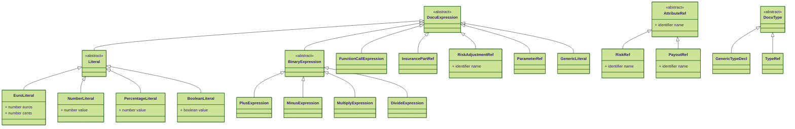

# Inheritance diagram for language InsuranceModel

```mermaid
    %%{init: {'theme': 'forest'} }%%
    classDiagram
    direction TD
    %% other possibilites: LR RL DT TB (same as TD)
    class Literal {
        <<abstract>>
        
    }
    class DocuExpression {
        <<abstract>>
        
    }
    class EuroLiteral {
        
        + number euros
		+ number cents
    }
    class NumberLiteral {
        
        + number value
    }
    class PercentageLiteral {
        
        + number value
    }
    class BooleanLiteral {
        
        + boolean value
    }
    class BinaryExpression {
        <<abstract>>
        
    }
    class PlusExpression {
        
        
    }
    class MinusExpression {
        
        
    }
    class MultiplyExpression {
        
        
    }
    class DivideExpression {
        
        
    }
    class FunctionCallExpression {
        
        
    }
    class InsurancePartRef {
        
        
    }
    class RiskAdjustmentRef {
        
        + identifier name
    }
    class ParameterRef {
        
        
    }
    class RiskRef {
        
        + identifier name
    }
    class AttributeRef {
        <<abstract>>
        + identifier name
    }
    class PayoutRef {
        
        + identifier name
    }
    class GenericTypeDecl {
        
        
    }
    class DocuType {
        <<abstract>>
        
    }
    class GenericLiteral {
        
        
    }
    class TypeRef {
        
        
    }
    DocuExpression <|-- Literal
Literal <|-- EuroLiteral
Literal <|-- NumberLiteral
Literal <|-- PercentageLiteral
Literal <|-- BooleanLiteral
DocuExpression <|-- BinaryExpression
BinaryExpression <|-- PlusExpression
BinaryExpression <|-- MinusExpression
BinaryExpression <|-- MultiplyExpression
BinaryExpression <|-- DivideExpression
DocuExpression <|-- FunctionCallExpression
DocuExpression <|-- InsurancePartRef
DocuExpression <|-- RiskAdjustmentRef
DocuExpression <|-- ParameterRef
AttributeRef <|-- RiskRef
AttributeRef <|-- PayoutRef
DocuType <|-- GenericTypeDecl
DocuExpression <|-- GenericLiteral
DocuType <|-- TypeRef

```
