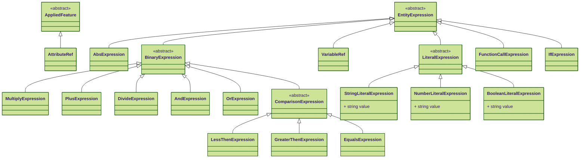

# Inheritance diagram for language EntityModel

```mermaid
    %%{init: {'theme': 'forest'} }%%
    classDiagram
    direction TD
    %% other possibilites: LR RL DT TB (same as TD)
    class AbsExpression {
        
        
    }
    class EntityExpression {
        <<abstract>>
        
    }
    class MultiplyExpression {
        
        
    }
    class BinaryExpression {
        <<abstract>>
        
    }
    class AttributeRef {
        
        
    }
    class AppliedFeature {
        <<abstract>>
        
    }
    class VariableRef {
        
        
    }
    class LiteralExpression {
        <<abstract>>
        
    }
    class StringLiteralExpression {
        
        + string value
    }
    class NumberLiteralExpression {
        
        + string value
    }
    class BooleanLiteralExpression {
        
        + string value
    }
    class PlusExpression {
        
        
    }
    class DivideExpression {
        
        
    }
    class AndExpression {
        
        
    }
    class OrExpression {
        
        
    }
    class ComparisonExpression {
        <<abstract>>
        
    }
    class LessThenExpression {
        
        
    }
    class GreaterThenExpression {
        
        
    }
    class EqualsExpression {
        
        
    }
    class FunctionCallExpression {
        
        
    }
    class IfExpression {
        
        
    }
    EntityExpression <|-- AbsExpression
BinaryExpression <|-- MultiplyExpression
EntityExpression <|-- BinaryExpression
AppliedFeature <|-- AttributeRef
EntityExpression <|-- VariableRef
EntityExpression <|-- LiteralExpression
LiteralExpression <|-- StringLiteralExpression
LiteralExpression <|-- NumberLiteralExpression
LiteralExpression <|-- BooleanLiteralExpression
BinaryExpression <|-- PlusExpression
BinaryExpression <|-- DivideExpression
BinaryExpression <|-- AndExpression
BinaryExpression <|-- OrExpression
BinaryExpression <|-- ComparisonExpression
ComparisonExpression <|-- LessThenExpression
ComparisonExpression <|-- GreaterThenExpression
ComparisonExpression <|-- EqualsExpression
EntityExpression <|-- FunctionCallExpression
EntityExpression <|-- IfExpression

```
