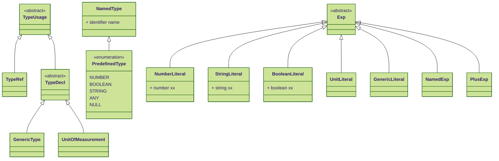

# Inheritance diagram for language XX

```mermaid
    %%{init: {'theme': 'forest'} }%%
    classDiagram
    direction TD
    %% other possibilites: LR RL DT TB (same as TD)
    class TypeRef {
        
        
    }
    class TypeUsage {
        <<abstract>>
        
    }
    class TypeDecl {
        <<abstract>>
        
    }
    class PredefinedType {
        <<enumeration>>
        NUMBER
		BOOLEAN
		STRING
		ANY
		NULL
    }
    class NamedType {
        
        + identifier name
    }
    class GenericType {
        
        
    }
    class UnitOfMeasurement {
        
        
    }
    class NumberLiteral {
        
        + number xx
    }
    class Exp {
        <<abstract>>
        
    }
    class StringLiteral {
        
        + string xx
    }
    class BooleanLiteral {
        
        + boolean xx
    }
    class UnitLiteral {
        
        
    }
    class GenericLiteral {
        
        
    }
    class NamedExp {
        
        
    }
    class PlusExp {
        
        
    }
    TypeUsage <|-- TypeRef
TypeUsage <|-- TypeDecl
NamedType <|-- PredefinedType
TypeDecl <|-- GenericType
TypeDecl <|-- UnitOfMeasurement
Exp <|-- NumberLiteral
Exp <|-- StringLiteral
Exp <|-- BooleanLiteral
Exp <|-- UnitLiteral
Exp <|-- GenericLiteral
Exp <|-- NamedExp
Exp <|-- PlusExp

```
